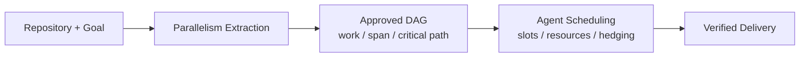
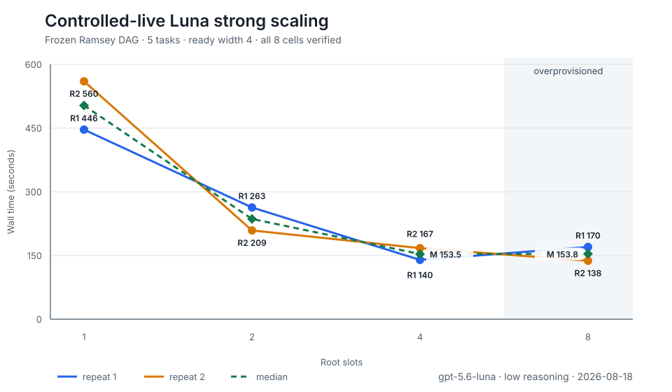
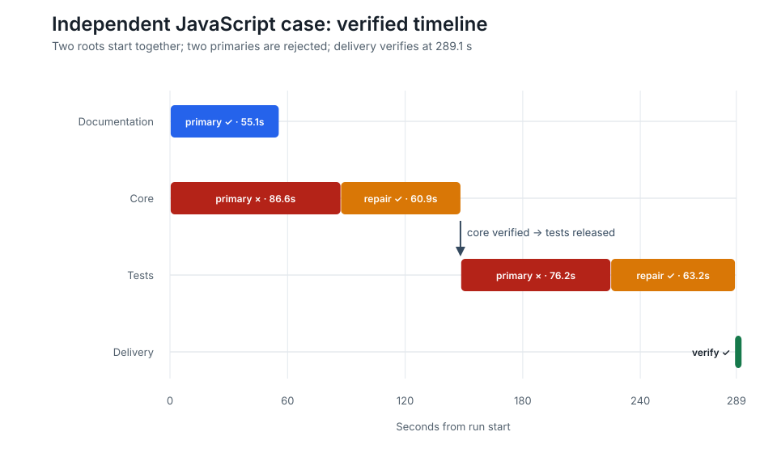
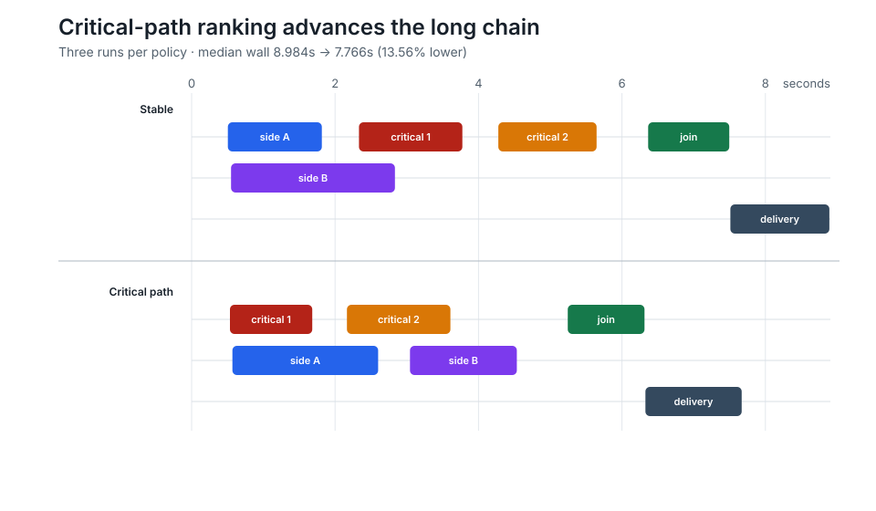

# FirstGreen

FirstGreen is an HPC-inspired, local-first runtime that extracts parallel work from a software-
engineering goal, then schedules coding agents against the resulting dependency graph to reduce
time-to-completion. Deterministic verification defines valid completion, so a worker saying “done”
does not create false speedup and a SQLite transaction still selects at most one winner.

> FirstGreen is the development codename used for the v0.1 release line; it is not presented as a
> registered trademark or a finalized commercial product name.
>
> The public repository begins with the privacy-compacted v0.1.0-rc1 source snapshot. Earlier
> experiment revision identifiers remain in the evidence bundle as provenance, not public commits.



## Evidence at a glance

The frozen controlled-live Ramsey matrix used `gpt-5.6-luna` with low reasoning, no subagents, one
attempt per task, and no hedging. All `1/2/4/8 × 2` cells produced five verified task winners and a
verified final delivery. Both repetitions are shown; speedup uses the first valid one-slot cell as
the predeclared baseline.



| Root slots | Repeat 1 wall / speedup | Repeat 2 wall / speedup | Median wall |
|---:|---:|---:|---:|
| 1 | 446.45 s / 1.00× | 560.13 s / 0.80× | 503.29 s |
| 2 | 263.05 s / 1.70× | 209.06 s / 2.14× | 236.06 s |
| 4 | 139.69 s / 3.20× | 167.28 s / 2.67× | 153.48 s |
| 8 | 170.08 s / 2.62× | 137.56 s / 3.25× | 153.82 s |

The fixed DAG has four independent roots followed by a join. Median wall time stopped improving
between four and eight slots, while root-slot utilization fell from 57–59% to about 29%. This is a
scoped result on one workload, model, and host—not a claim that coding agents generally scale by
the same factor. [Inspect the raw rows and validation](docs/evidence/results/controlled-live-ramsey-v2/README.md).

The independent JavaScript case exercises the product path rather than a benchmark-only path.
Luna extracted three tasks with two initially ready roots; the roots started 9.5 ms apart. The
verifier rejected two primary attempts, bounded repairs succeeded, and the composed delivery passed
9/9 Node tests in 289.09 s. This is one portability case, not a general JavaScript speedup claim.



[Inspect the sanitized trace, attempts, delivered diff, and frozen hashes](docs/evidence/results/javascript-idempotent-checkout-v1/README.md).

TinyShop supplies an equally important negative result. Two separately preserved Luna observations
both delivered correct code, but the extractor chose a serial implementation-to-tests graph with
ready width one instead of the fixture's expected branch/join. The result is retained as evidence
that planning quality, rather than configured capacity, can be the speedup limit.
[Inspect the negative extraction result](docs/evidence/results/controlled-live-tinyshop-s3-luna-v1/README.md).

The registered ready-queue ablation holds the five-task graph and two-root/one-verifier capacity
constant. Across three deterministic repetitions per policy, critical-path ranking selected the
long chain first and reduced median wall time from 8.984 s to 7.766 s (13.56%). This isolates a
scheduler policy; it is not a live-Agent latency claim.



[Inspect all six raw cells, decision orders, retained protocol deviations, and traces](docs/evidence/results/critical-path-ablation/README.md).

The credential-free scripted branch/join smoke separately exercises the production scheduler,
worktrees, verifiers, final delivery, accounting, and frozen-Manifest matrix. A local Windows run
on 2026-08-14 produced this single-repetition orchestration result:

| Root slots | Wall time | Speedup | Efficiency |
|---:|---:|---:|---:|
| 1 | 11.41 s | 1.00x | 100% |
| 2 | 6.72 s | 1.70x | 85% |
| 4 | 5.91 s | 1.93x | 48% |
| 8 | 5.17 s | 2.21x | 28% |
| 16 | 5.78 s | 1.97x | 12% |

Scripted and controlled-live values remain separate; deterministic worker timing is never presented
as real Agent acceleration.

The frozen public protocol, raw-result rules, report source, and release gate are collected in the
[publication package](docs/publication/README.md). See [REPRODUCIBILITY.md](REPRODUCIBILITY.md) for
the credential-free and explicitly opt-in live paths.

## 30-second product path

From a clean Git repository, run the normal goal-to-runtime entrypoint, review the extracted plan,
then approve it:

```bash
uv run fg request --planner-provider fake --adapter fake
```

The credential-free adapters let you inspect planning and scheduling without a paid call. Use
`--planner-provider codex` plus the default `codex_exec` worker only when authenticated execution is
intended. Reproduce the scripted evidence separately—the benchmark is the second command, not the
product entrypoint:

```bash
uv run fg benchmark scaling benchmarks/scripted-branch-join.yaml \
  --slots 1,2,4,8,16 --output-dir benchmark-results/scripted
```

## What the MVP does

- Turns a repository plus natural-language goal into reviewable semantic work units.
- Compiles artifacts, dependencies, write conflicts, resources, and verifiers into an executable DAG.
- Freezes deterministic duration estimates, work/span, critical path, ready width, exposed
  parallelism, and a bounded root-slot recommendation before approval.
- Schedules extracted plans with deterministic bottom-level critical-path rank while preserving a
  stable priority/ID fallback, and logs each ready-queue selection.
- Reads a strict YAML task manifest and dependency DAG.
- Runs fake or `codex exec --json` workers in isolated Git worktrees.
- Applies scheduler-owned command and changed-path verification.
- Atomically chooses the first verified winner and preserves its worktree.
- Composes multi-task DAG sinks into one separately verified final delivery worktree.
- Supports transparent delayed-hedge and AIMD concurrency policies with hard limits.
- Persists state, redacted events, policy snapshots, and decision logs in SQLite WAL.
- Exports JSON, CSV, standalone HTML, and sanitized Chrome/Perfetto runtime traces.
- Includes a seeded simulator for policy validation; it is evidence tooling, not the product runtime.
- Replays one frozen production Manifest across slot capacities with an append-only raw journal;
  this scaling command measures the runtime but does not define a separate execution model.
- Accepts inline text, local files, stdin, and the clipboard through one `WorkRequest` model.
- Provides a foreground terminal UI for plan review, persisted scheduler status, and final evidence.

It does not merge, push, deploy, run remote workers, provide a SaaS UI, or read/store hidden
chain-of-thought.

## Install for development

Python 3.12+ and Git are required. `uv` is the supported toolchain:

```bash
uv sync --all-extras
uv run fg --help
uv run fg doctor
```

On Windows, the source checkout also includes a zero-install launcher:

```powershell
.\fg.ps1
```

To install the wheel for the current user and create a Start menu shortcut:

```powershell
powershell -ExecutionPolicy Bypass -File scripts\Install-FirstGreen.ps1
```

FirstGreen stores only non-secret convenience defaults in `~/.firstgreen/config.yaml`. Configure
the locally usable Codex CLI, worker model, reasoning level, and state directory once:

```powershell
.\fg.ps1 configure --auto-codex --model MODEL_ID --reasoning low --show
```

`--auto-codex` tests local `--version` and `exec --help` only; it does not start a paid turn. The
discovery order is an explicit CLI path, saved configuration, `FIRSTGREEN_CODEX_BINARY`,
`$CODEX_HOME/.sandbox-bin/codex`, and finally `PATH`. Credentials and API keys are neither accepted
nor persisted. An interactive `fg` session runs this preflight before asking for the request.

Quality gates:

```bash
uv run ruff check .
uv run ruff format --check .
uv run mypy src tests
uv run pytest
```

Live Codex tests are skipped unless `FIRSTGREEN_RUN_LIVE_CODEX_TESTS=1` is explicitly set.

## Daily CLI and TUI

Enter any Git repository and run `fg`. Paste the original request, submit it with a blank line,
review the validated plan, and choose execute, export/edit, single-task execution, or cancel.

```bash
cd my-project
uv run fg
```

The review screen shows the original request, proposed work units, allowed write paths, the DAG,
conflict locks, exact scheduler-owned verifier commands, risk, and deterministic repairs. It also
states that no worker has started. Execution begins only after the explicit **approve and execute**
choice; exporting a plan or replacing it with one task returns to a reviewable artifact rather than
silently running it.

Chinese planning requests recognize common schema/database, service, API, notification, test, and
documentation concepts. The default fake planner remains local and deterministic. Selecting
`--planner-provider codex` now always makes one bounded read-only planner call in `auto` mode,
including when the cheap classifier initially recommends one task; deterministic compilation may
still safely reduce the proposal to one task. The configured Codex binary and planner model are
shared with that call.

Choosing **edit YAML and review again** opens `$FIRSTGREEN_EDITOR`, `$EDITOR`, Windows Notepad, or a
local terminal editor. After the editor closes, FirstGreen re-scans the repository, revalidates the
candidate, persists the edit audit, and returns to the approval screen. A planner launch, timeout,
or schema failure is shown as an explicit single-task fallback and is not cached as a successful
plan.

FirstGreen blocks a dirty repository by default because planning from uncommitted files while
starting workers from `HEAD` would give the two stages different inputs. Choose one behavior
explicitly when needed:

```bash
fg run "Fix the local change" --dirty-mode head       # ignore local changes
fg run "Finish the local change" --dirty-mode snapshot # capture local changes safely
```

`head` uses an isolated clean clone pinned to the selected commit. `snapshot` creates a managed
clone below `STATE_DIR/repository-snapshots`, copies Git-visible modified/untracked/deleted files,
excludes ignored files, and commits only in that clone. The source repository's files, index, HEAD,
and `.git` are not modified. Planner, scheduler, worktrees, verifier, reports, and policy snapshots
all use and record the same resulting SHA. Changed symbolic links and snapshot roots inside the
target repository are rejected. Configure the default with `fg configure --dirty-mode MODE`.

The same production path supports non-interactive input:

```bash
uv run fg "Fix upload name collisions and add regression tests"
uv run fg plan "Add pagination to the order endpoint"
uv run fg run request.md
echo "Add pagination to the order endpoint" | uv run fg run -
uv run fg clip
```

Pin the coding worker without editing a generated manifest:

```bash
uv run fg run request.md --model MODEL_ID --reasoning low --codex-binary /path/to/codex \
  --verifier-python /path/to/project-python
```

`--model` is an alias for `--worker-model`; `--reasoning` accepts the Codex-supported effort
levels. The resolved worker configuration is written to a new manifest and persisted in every
attempt snapshot.

FirstGreen automatically looks for `.venv` or `venv` in the original source repository, including
when workers run from a managed snapshot. It binds logical `python`/`python3` verifier commands to
that environment and resolves every other bare verifier executable before any worker starts. The
resolved paths, discovery mode, source repository, and warnings are persisted in the manifest and
run policy snapshot. If no project environment exists, Python is pinned from `PATH` with a visible
warning; a missing executable blocks the run before Codex can consume budget.

`--verifier-python` remains the explicit highest-priority override and pins both `python` and
`python3`. FirstGreen does not create environments or install dependencies automatically, and it
cannot preflight arbitrary commands that explicitly opt into shell semantics. Python tool commands
are discovered from tool sections, dependency groups, and common pytest/Ruff/mypy config files.

`fg` and `firstgreen` are equivalent installed commands. Natural-language runs plan automatically;
use `--plan none` to force one task. The default planner is deterministic and local. An authenticated
Codex planning call is explicit with `--planner-provider codex`. Coding workers default to
`codex_exec`; use `--adapter fake` for a credential-free scheduler/workspace/verifier run. The fake
worker is deterministic and does not implement the requested code change, so it is evidence about
orchestration rather than semantic coding quality.

During a foreground run the TUI reads scheduler-owned SQLite state and displays ready, running,
verifying, verified, failed, and cancelled tasks. It does not select winners or infer success from
agent messages. When the run ends, the terminal shows the scheduler result, winner and preserved
worktree, every verification round and exit code, verifier-reported changed files, worker token
usage when available, and exact report/status/log or recovery commands. The target repository's
main working tree is never merged automatically.

For a successful multi-task DAG, FirstGreen creates one additional `__delivery__` worktree from the
same base SHA. It overlays only scheduler-verified sink snapshots, rejects conflicting file content,
and runs the de-duplicated union of every task's deterministic verifier commands. The run is not
`completed` unless this aggregate verification passes. The delivery path and its verification rows
appear in terminal output, status JSON, exports, and the HTML report. A failed/conflicting delivery
is preserved for inspection; all task winners also remain intact. Single-task runs continue to use
their sole winner directly and do not create a redundant delivery worktree. Nothing is merged or
committed to the user's main working tree.

Every run also writes `STATE_DIR/reports/RUN_ID/report.html`. Interactive terminals get the human
result panel; redirected or piped commands retain the compact JSON result for scripts. For
diagnostics:

```bash
uv run fg status RUN_ID --json
uv run fg logs RUN_ID --json
uv run fg cancel RUN_ID
uv run fg report RUN_ID
```

If a worker finished and its preserved worktree either failed deterministic verification or could
not reach verification because worker-event ingestion failed, run verification without another
worker or model call:

```bash
uv run fg reverify RUN_ID --attempt ATTEMPT_ID --manifest /exact/original/resolved-manifest.yaml \
  --verifier-python /path/to/project-python
```

Reverification requires the exact original manifest bytes, a failed single-task run with no
winner, an existing database-matched worktree, a matching marker, and Git worktree registration.
It is capped at three total verification rounds. Every round is retained in the audit log and a
passing round still uses the same atomic winner transaction.

There is intentionally no `--detach` yet. Without a daemon, FirstGreen cannot truthfully promise
cross-process ownership and cancellation of an in-flight Codex process.

## Cost-free manifest quick start

The repository must have at least one commit because every attempt is a Git worktree.

```bash
uv run fg validate examples/fake.yaml
uv run fg run examples/fake.yaml --policy single
uv run fg status
uv run fg benchmark simulate examples/simulator.yaml
```

Explicit plan export/edit workflow:

```bash
uv run fg scan --repo .
uv run fg plan request.md --repo . --output plan.yaml
uv run fg validate-plan plan.yaml
uv run fg run request.md --plan auto --yes --repo . --adapter fake --dry-run
```

The default fake planner is deterministic and free. Use `--planner-provider codex` only when one
authenticated structured planning call is explicitly desired. The LLM proposal is never executable
until deterministic compilation, validation, conflict analysis and approval complete.

Non-interactive `run` prints a `run_id`; foreground TUI runs include it in the result panel. The
standalone report is generated automatically, and the same evidence can be regenerated or exported:

```bash
uv run fg report RUN_ID
uv run fg export RUN_ID --format json
uv run fg export RUN_ID --format csv
uv run fg export RUN_ID --format trace
```

State defaults to `~/.firstgreen`, outside the target repository's main working tree. Override it
with `--state-dir` for isolated tests.

## Planning and scheduling testbed

The bundled TinyShop testbed exercises the production planner, compiler, scheduler, Git worktree,
dependency overlay, verifier, winner transaction, and delayed-hedge paths. Fake planner and worker
adapters provide deterministic inputs; they do not replace scheduler behavior.

```bash
uv run python -m testbed.run --scenario all --fake-planner --fake-worker
```

Reports are written to `tests/firstgreen_testbed_package/reports/`. Live planner and coding runs are
separate, explicit opt-ins; see the testbed README for environment variables, budget controls, and
the limited S1-S3 live coding matrix. S6 is never executed.

## Authenticated Codex demo

First run `codex login` using an official authentication method, verify the exact executable, then
run:

```bash
uv run fg doctor --codex-binary /path/to/codex
uv run fg run examples/live.yaml --policy single --model MODEL_ID --reasoning low \
  --codex-binary /path/to/codex --verifier-python /path/to/project-python
```

The adapter uses `codex exec --json --sandbox workspace-write -c agents.max_threads=N <prompt>`.
The sandbox is explicit and minimal for editing. `danger-full-access` is never the default.
FirstGreen explicitly disables Codex `code_mode` and `code_mode_host` by default because those
features require a complete matching CLI bundle; removing those entries from `disabled_features`
is an explicit opt-in. This is intended to use the standard Codex shell/edit path; an authenticated
post-fix smoke test is still required for each installed CLI bundle.

### Bounded live multi-task acceptance

The TinyShop acceptance path uses the same planner compiler, manifest, `SchedulerService`, Codex
worker adapter, isolated worktrees, deterministic verifiers, transactional winners, and final
delivery assembly as the product. It is not a parallel test-only scheduler. Paid runs require one
explicit S1, S2, or S3 scenario, an explicit model, and an acknowledged task ceiling. Hedging is
disabled, every task has one primary attempt, nested agent threads are capped at one, and each
attempt has a bounded timeout.

PowerShell example for the three-task S2 scenario:

```powershell
$env:FIRSTGREEN_RUN_LIVE_TESTBED_CODING = "1"
$env:FIRSTGREEN_CODEX_BINARY = "C:\path\to\codex.exe"
uv run python -m testbed.run --scenario S2 --fake-planner --live-coding `
  --model MODEL_ID --reasoning low --max-live-tasks 3 --live-timeout-seconds 900
```

Planning-only live acceptance uses one paid planner call and never starts workers:

```powershell
$env:FIRSTGREEN_RUN_LIVE_TESTBED_PLANNER = "1"
uv run python -m testbed.run --scenario S3 --live-planner --fake-worker `
  --model MODEL_ID --reasoning low --live-timeout-seconds 900
```

Reports record whether live work ran or was skipped, the safety snapshot, attempts, wall time,
delivery verification, and token/cost data when emitted by Codex. Missing usage or cost stays
`null`; FirstGreen does not invent an estimate. This testbed cannot enforce a monetary ceiling
when the installed Codex CLI supplies no preflight price or billable-cost signal, so scenario,
task-count, attempt, concurrency, and timeout caps are the hard local controls.

## Safety boundary

Repositories and verifier commands are potentially dangerous. FirstGreen is an orchestrator, not
a complete OS/container sandbox. Use low-privilege credentials, review verifier commands, and do
not expose broad secrets to untrusted repositories. Hedging is impossible unless `replay_safe=true`.
Cleanup requires all of: a path below the dedicated workspace root, matching database/workspace
identity, a matching marker, and Git worktree registration. Winner cleanup is refused by default.

Event capture filters prompts, reasoning, agent messages, commands, command output, and secrets by
default. Codex stderr is drained but persisted only as byte/line counts unless sensitive local
capture is explicitly enabled. Even with that opt-in, credential-like JSON fields remain redacted.
Verifier command rows and terminal status are persisted. Output evidence stores byte counts and
SHA-256 digests rather than raw stdout/stderr, so verifier output cannot accidentally persist a
credential.

## Known limitations

- macOS and Linux are the supported CI targets; native Windows is best-effort, WSL2 is recommended.
- Managed clone directories, worktree directories, and internal Git refs use short hashed names to
  leave headroom under legacy Windows path limits; placing the state directory itself extremely
  deep can still exceed limits imposed by the installed Git/Windows configuration.
- `codex exec` cancellation is best-effort and cannot prove immediate server-side cancellation.
- A one-shot process cannot reattach to every orphaned Codex subprocess after a crash; reconciliation
  records unresolved attempts conservatively.
- SQLite is intended for one local scheduler, not a distributed fleet.
- The empirical hedge model treats cancelled/censored samples conservatively and is not survival
  analysis.
- Simulator results are synthetic evidence, never a real-world savings claim.
- Shell verifier commands require explicit `shell: true`; argv commands are strongly preferred.
- `reverify` currently supports terminal single-task runs only; it does not resume a partially
  completed multi-task DAG.

See the active [HPC runtime roadmap](docs/ROADMAP.md),
[benchmark methodology](docs/benchmark-methodology.md), [the PRD](01_PRODUCT_PLAN_AND_PRD.md),
[technical specification](02_TECHNICAL_SPEC.md),
[implementation backlog](03_IMPLEMENTATION_BACKLOG.md), [planning subsystem](04_PLANNING_SUBSYSTEM.md),
and [engineering rules](AGENTS.md).
