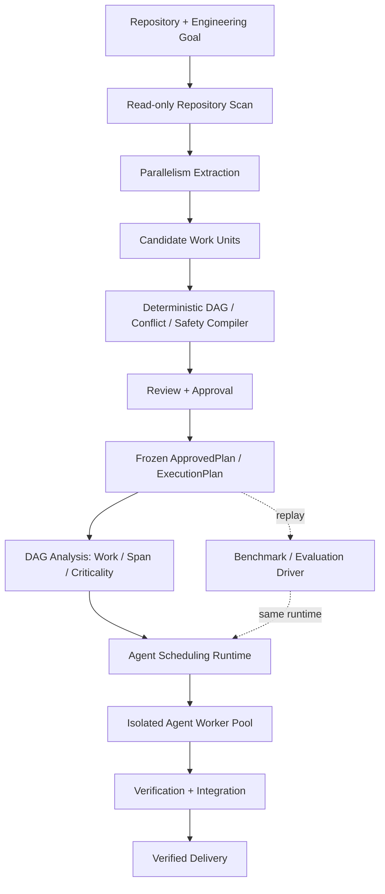

# FirstGreen 下一步路线图：Parallelism Extraction + Agent Scheduling

> 状态：Active
>
> 生效日期：2026-08-13
>
> 最晚毕业日期：2026-09-10
>
> 时间上限：20 个工作日
>
> 版本状态：已由 owner 确认并纳入 `codex/hpc-runtime-roadmap` 实施基线
>
> 文档盘点：[INTERNAL_DOCUMENTS_AUDIT.md](INTERNAL_DOCUMENTS_AUDIT.md)

## 1. 本文的权限与纠正

从 2026-08-13 起，本文是 FirstGreen 唯一的未来工作优先级。它覆盖旧 PRD、技术规格、backlog、launch plan、企划书和视频脚本中的未来承诺，但不削弱 `AGENTS.md`、ADR、安全边界和现有 correctness invariants。

本版明确纠正两个先后关系：

1. FirstGreen 的核心不是 reliability，而是从软件工程任务中提取并行度，并通过调度缩短完成时间。
2. FirstGreen 的核心也不是 benchmark。Benchmark 用来验证加速、解释损失和展示项目意义；它复用正式 runtime，不定义产品本体。

一句话原则：

> **先造出一个能从工程目标里找到并行度、再把并行度兑现成更短 makespan 的 runtime；然后用 benchmark 说明它快了多少、为什么没有无限加速。**

## 2. 项目定位与北极星目标

FirstGreen 是：

> **An HPC-inspired runtime that extracts parallelism from software-engineering goals and accelerates their completion through dependency-aware scheduling, adaptive concurrency, and speculative execution.**

补充说明：

> Deterministic verification defines completion, so acceleration is measured only between valid engineering results.

产品的核心问题是：

> 给定一个 repository 和 engineering goal，怎样提取一个安全、可执行且具有真实并行度的 work-unit DAG，并在依赖、写冲突、资源约束和随机长尾下调度 Agent，从而最小化 verified makespan？

技术叙事顺序固定为：

> **Parallelism extraction → Scheduling → Straggler mitigation → Resource contention → Verification**

项目自己的 meta KPI 是：

> 外部读者五分钟内能看懂并运行 `repo + goal → extracted DAG → scheduled Agent workers → verified delivery`，并在紧随其后的 scaling curve 和 runtime trace 中看到这个 runtime 是否真的加速、并行效率损失在哪里。

### 2.1 不夸大的边界

“HPC-inspired” 表示 FirstGreen 借用 work/span、critical path、list scheduling、resource admission、speculative execution 和 congestion control 等思想。v0.1 仍然是单机、local-first、Codex-first runtime，不声称是超级计算机、通用分布式集群管理器或最优调度器。

v0.1 必须有可用的 parallelism extraction；但它不需要证明提取结果全局最优。以下内容留到后续研究：cohesion-aware partitioning、communication-cost model、symbol-level overlap、自动任务粒度优化和 planner quality 大规模评测。

## 3. 产品本体：从 Goal 到 Verified Delivery



Benchmark 是这张图里的旁路消费者：先从正式产品路径得到并批准 `ExecutionPlan`，再冻结并重放它。它不能拥有另一套 task model、DAG compiler 或 scheduler。

### 3.1 正式输入输出合同

```text
Goal
  repository snapshot / base SHA
  engineering request
  allowed / denied paths
  planning and execution limits

CandidatePlan
  semantic work units
  proposed artifacts and likely paths
  uncertainty and verification hints

ApprovedPlan（产品语义上的 ExecutionPlan）
  immutable work units
  deterministic dependency edges
  write-conflict and shared-resource constraints
  task and final verifiers
  duration estimate + source
  work / span / critical path / exposed parallelism
  approval and safety record

Run
  scheduling policy and hard limits
  attempts / workspaces / decisions / trace
  verified delivery or explicit failure
```

本文的 `ExecutionPlan` 是“已批准、可执行计划”的产品语义名。v0.1 优先扩展现有 `ApprovedPlan`，不为命名新增一个中间类或数据库实体；`plan_to_manifest()` 继续负责向 scheduler `Manifest` 的单向、确定性编译。Benchmark 更不能另造平行领域模型。

## 4. 核心能力一：Parallelism Extraction

Parallelism extraction 回答的不是“能否把文字切成几个小标题”，而是：

> 哪些 work units 能独立取得可验证进展，哪些存在真实先后关系，哪些会因写集合或资源冲突而不能同时运行？

### 4.1 Pipeline

```text
goal
 → bounded read-only repository map
 → single/decompose decision
 → bounded semantic work-unit proposal
 → deterministic artifact-edge compilation
 → write-conflict / resource analysis
 → validation and safe merge/fallback
 → work/span/criticality analysis
 → review and approval
 → immutable ApprovedPlan / ExecutionPlan
```

LLM 只可以提议 semantic work units、artifacts、likely paths、risk 和 uncertainty。确定性代码继续拥有：

- DAG edges；
- cycle detection；
- artifact producer/consumer legality；
- allowed/denied paths；
- write conflicts 和 capacity-one resources；
- verifier eligibility；
- risk/approval；
- work/span 计算；
- execution eligibility。

如果任务没有可利用并行度，系统必须明确输出 sequential plan 或 insufficient parallelism；不为了让图好看而伪造 tasks。

### 4.2 v0.1 Extraction 输出

每个 approved plan 在执行前必须展示并持久化：

- task count 和 edge count；
- 每个 work unit 的 objective、paths、produces/requires、dependencies、resources 和 verifier；
- duration estimate 及来源；
- estimated work `W`；
- estimated span `L`；
- theoretical exposed parallelism `W/L`；
- structural ready width；
- critical path；
- recommended root slots；
- validation warnings、repairs、conflicts 和 approval decision。

Recommended slots 必须是有 hard min/max 的可解释建议：默认受 `ceil(W/L)`、ready width、用户上限和 thread budget 共同约束，记录计算依据，并允许用户在执行前下调；它不是 LLM 可直接批准的资源决定。

节点时长的可信来源依次为：冻结历史中位数、独立 calibration、预注册人工估计、unit-weight fallback。本轮 execution 的未来结果不得反向影响同一轮计划。

### 4.3 当前实现基础与本月缺口

仓库已有 read-only scanner、bounded planner、artifact edge compiler、cycle/overlap validation、approval persistence 和 Manifest 编译。这些不是要推倒重写的旧功能，而是 parallelism extraction 的第一版骨架。

当前必须补齐：

- 把 planning 从可选前置功能提升为标准 `repo + goal` 产品入口；
- 把“1–5 tasks”从纯规划约束重新审视为 v0.1 产品上限，而不是 benchmark 上限；
- 为 work units 增加 duration estimate/source；
- 在 approved plan 上计算 work、span、critical path 和 ready width；
- 用 DAG criticality 生成 scheduler 可消费的 rank，而不是全部 `priority=0`；
- 让 plan view 先解释可利用并行度，再请求审批；
- 保留手写 plan/manifest 作为 expert 和 benchmark replay 入口。

本月不通过粗暴提高 `max_tasks` 来制造 16-way 数字。先保证 1–5 个 semantic work units 能真实拆分、验证并并行执行；更大 DAG 可来自多个 issue/work-item 的 authored batch 或后续 extraction 优化。

## 5. 核心能力二：Agent Scheduling Runtime

Parallelism extraction 负责暴露可并行 work；scheduler 负责兑现这些并行度。

### 5.1 Ready 与 admission

任务只有同时满足以下条件才可 dispatch：

- 所有 DAG dependencies 已 verified；
- write-conflict/shared-resource lease 可取得；
- root slot 可用；
- verifier、workspace 和 total-thread hard limits 可满足；
- policy、预算、replay safety 和 approval 允许。

依赖未满足的任务永不启动。ready work 被资源或 policy 挡住时必须记录 hold reason，不能只表现成“scheduler 没有动作”。

### 5.2 Critical-path-aware scheduling

当前 stable baseline 是 `(-manifest_priority, task_id)`，而 planner 编译结果全部 `priority=0`。v0.1 新增正式 policy `critical_path`：

```text
rank(v) = estimated_duration(v) + max(rank(s) for s in successors(v))
```

sink 的 rank 等于自身估计时长；无可信时长时退化为 unit-weight downstream depth。ready set 的确定性排序为：

```text
(-rank, -manifest_priority, task_id)
```

要求：

- production ready loop 与 `scheduler/queue.py` 只有一个排序事实源；
- policy、ready set、rank、selected task、estimate source/hash 写入 decision log；
- 不改变 DAG、安全资格或 resource constraints；
- stable policy 永远可回退；
- critical-path policy 是产品能力，不是 benchmark 脚本里的特殊分支。

### 5.3 Resource admission 与 concurrency

v0.1 保留并收紧：

- root-agent slots；
- nested-thread total budget；
- keyed resource leases；
- service-wide verifier capacity；
- static min/max；
- bounded AIMD root concurrency；
- static deterministic fallback；
- 每次 hold/increase/decrease 的 signal log。

AIMD 的定位是 online congestion control for agent compute。当前 production 信号仍不完整，因此 v0.1 只声称 bounded controller 和可观测 decision，不声称已经找到普遍最优并发。

### 5.4 Stochastic straggler mitigation

已有 delayed hedge/always race 统一定位为 speculative execution。它们服务于随机长尾，而不是项目的 reliability headline。

必须继续满足：

- 仅 replay-safe task 可复制；
- primary 到 threshold 时仍 active 才叫 tail hedge；
- failure retry/repair 与 tail hedge 分开记账；
- replica 与 ready work 共享 root-slot budget；
- winner transactional；
- loser cancel/cleanup 不触碰 winner。

History/P90 hedge 是有价值的 policy 增量，但不阻塞 v0.1。runtime 尚未全局优化“启动 replica”与“启动另一 ready task”的 opportunity cost；不得把 task-local hedge 写成全局最优 speculative scheduler。

### 5.5 Verification 的正确位置

Verification 仍不可绕过，但角色是：

- 定义合法完成时刻；
- 防止错误输出制造虚假加速；
- 决定 speculative winner；
- 验证 final integration；
- 使不同计划和 policy 的 makespan 可比较。

worktree isolation、single winner、winner retention、path-bounded cleanup 和 final delivery 继续是 correctness gate，不是本月主创新。

## 6. Runtime Observability

Observability 是 scheduler 的正式能力，不只是 benchmark telemetry。用户应能解释一次 run 为什么没有更快。

### 6.1 执行前

- DAG、work、span、critical path；
- initial ready set 和 recommended slots；
- predicted conflicts/resources；
- duration estimate source；
- static lower bound `T*_N = max(W/N, L)`。

### 6.2 执行中与执行后

- task ready/admitted/started/completed/verified；
- root-slot acquire/release；
- resource-lock wait；
- verifier queue/service time；
- final integration time；
- ready-task count、active workers、current root limit；
- scheduler loop overhead；
- hedge/repair/cancel/winner；
- host load/memory 与可取得的 provider pressure；
- primary、replica、loser 和 total agent-seconds。

Idle slot-time 尽量按互斥、可观测事实分类：dependency-limited、parallelism-exhausted、admission-limited、resource-locked、verifier-limited、scheduler-delay、unclassified。不可取得的 provider queue time 保持 unavailable，不猜测。

### 6.3 Runtime trace

导出 sanitized Perfetto/Chrome Trace：Agent、root admission、verifier、integration lanes，加 ready parallelism、active workers、root limit、verifier queue 和可取得的 host counters。

trace 从已过滤的 persisted events 生成，不写入 prompt、reasoning、Agent message、secret 或本机私密绝对路径。

## 7. Benchmark 与证据：验证层，不是产品核心

### 7.1 正确角色

Benchmark 负责回答：

- extraction 暴露的并行度能否被 scheduler 利用？
- 与同一 DAG 的 one-slot execution 相比，makespan 缩短多少？
- speedup 在哪里因 span、冲突、长尾、验证和 contention 损失？
- critical-path scheduling、hedging 和 AIMD 是否改善对应瓶颈？

它不负责：

- 定义另一套 job/task 数据模型；
- 绕过用户入口手写一个只能评测的系统；
- 取代 parallelism extraction；
- 决定 production scheduler 的特殊行为。

规则是：

> **Plan once, approve once, freeze once, replay many times.**

正式产品路径先生成 approved `ExecutionPlan`。Benchmark driver 只改变预注册的 slots/policy、重复执行同一 frozen plan，并导出 raw results。

### 7.2 Strong-scaling 定义

对固定 execution plan 和 slots `N`：

- `T_N`：从 runtime admission 到 final delivery verified 的 makespan；
- `S_N = T_1 / T_N`；
- `E_N = S_N / N`；
- `W = Σ d_v`；
- `L = max_path Σ d_v`；
- `T*_N = max(W/N, L)`：忽略 setup、验证、争用和随机性的结构性 lower bound；
- `U_N = root-slot-busy-seconds / (N × T_N)`；
- total/useful/wasted agent-seconds。

这里的 `T_1` 是同一个已分解 ExecutionPlan 只给一个 root slot，不是让一个 Agent 直接解决未分解原始 goal。后者可另做产品对照，但不能叫 strong scaling。

只有 final delivery verified 的 run 产生有效 `T_N`。失败、timeout、invalid 和截尾时间全部保留；小样本不拿 P95 当 headline。

### 7.3 最小展示集

Benchmark 保持薄而有代表性，不做全笛卡尔积：

1. `scripted/fake`：同一 DAG 的 `1/2/4/8/16`，验证 accounting、trace 和 capacity。
2. `controlled-live`：一个 approved batch plan 的 `1/2/4/8 × 2`；live 16 仅在 ready width、`W/L`、provider、host 和预算门通过时做 probe。
3. `end-to-end extraction demo`：至少两个真实 repo+goal 经正式 extraction 得到 plan，再执行 `N=1` 与一个 parallel N。
4. `scheduler ablation`：stable 与 critical-path 在一个 scheduler-sensitive DAG 上对照。
5. 可选 targeted probes：no-replication vs fixed-delay；static vs bounded AIMD。

三层结果严格标记为 scripted/fake、controlled-live、real-world-live，不混算。

### 7.4 README 中的位置

README 首屏顺序：

1. 一句话定位；
2. `Goal → Parallelism Extraction → Scheduling → Verified Result` 小图；
3. 紧接一张 strong-scaling/efficiency 图；
4. 一张 runtime trace；
5. 30 秒产品 quickstart；
6. benchmark 复现命令。

因此 benchmark 第一眼可见，但标题明确为 evidence，不是产品功能清单的第一项。

## 8. P0、P1 与明确非目标

### P0：产品毕业前必须完成

1. `repo + goal → CandidatePlan → ApprovedPlan/ExecutionPlan → Manifest → Run` 成为完整产品路径。
2. Parallelism extractor 能输出可验证 work units、DAG、冲突/资源、work/span、critical path 和 recommended slots。
3. Approved plan 能被 production scheduler 直接消费，不靠 benchmark 特殊入口。
4. Critical-path scheduling 成为正式、可解释、可回退的 production policy。
5. Root slots、resource locks、shared verifier capacity 和 bounded concurrency 进入统一 admission。
6. Scheduler decisions 与 Perfetto/Chrome Trace 能解释 parallelism utilization 和主要等待。
7. Verification、winner、worktree、delivery 和 cleanup invariants 保持全绿。
8. 用薄 benchmark driver 生成公开 scaling evidence、raw data 和 README 首屏图。
9. 从 clean checkout 完成文档、CI、构建与 v0.1/rc 发布。

### P1：P0 完成且仍有时间才做

- history/P90 hedge production 闭环；
- trace replay/discrete-event simulator；
- 更大的 extraction task 上限；
- cohesion/communication-aware partitioning；
- 更完整的 provider pressure 信号；
- 更多仓库/repetitions、bootstrap CI；
- workshop-style report、视频、GitHub Pages、PyPI。

### 本月明确不做

- SaaS、React dashboard、GitHub App；
- daemon、remote runner、Kubernetes、cluster control plane；
- 新 Agent provider；
- 自动 PR/merge/push/deploy；
- ML/RL scheduler、survival/hazard model；
- symbol-level optimal partitioner；
- 让 LLM 拥有 DAG edges、locks、安全资格或 completion truth；
- 为跑出漂亮曲线修改正式 plan、prompt、verifier 或指标；
- benchmark-only scheduler 或第二套 execution model；
- 商业版、RBAC、SSO、VPC。

## 9. 20 个工作日安排

| 阶段 | 工作日 | 产品输出 | 硬退出条件 |
|---|---:|---|---|
| A 核心合同与基线 | D1–D2 | Goal→Plan→Run 合同、可信 checkpoint、正确性风险修复 | 全工程门绿；主数据模型明确 |
| B Parallelism extraction | D3–D7 | repo scan、work units、DAG/conflict compiler、work/span、approval | 两个 repo+goal 能生成并冻结 execution plan |
| C Scheduling runtime | D8–D13 | CP ready queue、admission、shared verifier、concurrency、trace | approved plan 能并行运行并 verified delivery |
| D Validation/evidence | D14–D17 | 薄 matrix driver、scaling curve、CP 对照、端到端 demo | evidence 复用 production plan/runtime |
| E Release | D18–D20 | README、raw results、limitations、CI、tag/rc | clean checkout 可重建；声明不超过证据 |

### 9.1 D1–D2：核心合同与基线

- 审查 dirty working tree，形成可审查 checkpoint；
- 统一 Goal、CandidatePlan、ApprovedPlan（ExecutionPlan）、Manifest 和 Run 的边界；
- 修复 admission 前 workspace leak、指标错误等会污染 runtime 的 correctness 风险；
- 运行 `ruff check`、`ruff format --check`、`mypy src tests`、`pytest`；
- 统一 README、known limitations 和 release notes 的 HPC-first 口径。

### 9.2 D3–D7：Parallelism extraction

- D3：把 repo+goal planning 设为标准用户 vertical slice，保留 authored-plan bypass；
- D4：完善 bounded repo scan 和 semantic work-unit proposal；
- D5：固化 artifact edges、cycle、allowed/denied paths、write conflicts、resource locks 和 verifier eligibility；
- D6：增加 duration estimate/source、work/span、critical path、ready width 和 recommended slots；
- D7：在至少两个 repo+goal 上完成 `scan → plan → validate → review/approve → frozen ExecutionPlan`。

Exit：至少一个非平凡计划包含真实 branch/join；没有并行度的任务能诚实返回 sequential。

### 9.3 D8–D13：Scheduling runtime

- D8：统一 production ready queue 和 stable baseline；
- D9：实现 bottom-level rank 与 critical-path policy；
- D10：把 dependencies、write/resource locks、root slots、workspace 和 service-wide verifier capacity 纳入 admission；
- D11：整理 static/AIMD hard min/max、signals、decision log 和 fallback；
- D12：整理 tail hedge、repair、ready-work slot competition 和 cancellation semantics；
- D13：完成 `approved plan → parallel Agent run → final verified delivery`，同时导出 scheduler trace。

Exit：至少一个 deterministic nontrivial DAG 在多 slots 下减少 makespan；CP policy 在 production path 可用、可解释、可回退。

### 9.4 D14–D17：Validation 与 evidence

- D14：实现只接收 frozen ExecutionPlan 的薄 matrix driver 和 append-only raw journal；
- D15：完成 scripted `1/2/4/8/16`、accounting 和 trace golden checks；
- D16：完成 controlled-live `1/2/4/8 × 2`；容量门通过才追加 16-slot probe；
- D17：完成 stable/CP 对照、两个 end-to-end extraction demos 和结果分析；有余量再做 hedge/AIMD targeted probe。

实验开始后不修改 frozen plan、prompts、verifiers、duration snapshot 或指标。发现合同 bug 时保留 invalid cells，换 experiment ID，不覆盖旧结果。

### 9.5 D18–D20：Release

- D18：生成 README 首屏图、architecture、methodology、limitations 和 negative results；
- D19：clean checkout 重建 raw summary、figures、package 和跨平台 CI；
- D20：tag `v0.1.0`，或按 gate 降级为 `v0.1.0-rc1`，随后停止扩功能。

## 10. 可直接转成 issue 的执行清单

| ID | 工作 | 验收标准 |
|---|---|---|
| CORE-01 | Goal→Plan→Manifest→Run 合同 | 复用现有类型并单向确定性编译，无 benchmark 平行模型 |
| CORE-02 | 基线 correctness 修复 | workspace/admission/metrics tests |
| EXTRACT-01 | repo+goal product entry | scan/plan/validate/approve vertical slice |
| EXTRACT-02 | bounded work-unit proposal | 非平凡与 sequential fixtures |
| EXTRACT-03 | deterministic DAG compiler | edges/cycles/artifacts golden tests |
| EXTRACT-04 | conflict/resource compiler | write overlap 与 lease tests |
| EXTRACT-05 | DAG performance analysis | work/span/path/width/slot recommendation |
| EXTRACT-06 | plan view + persistence | estimate、analysis、approval 可审查 |
| SCHED-01 | central ready queue | production/helper 单一事实源 |
| SCHED-02 | critical-path policy | rank/fallback/decision log |
| SCHED-03 | unified admission | DAG/resource/root/workspace/verifier capacity |
| SCHED-04 | bounded concurrency | static/AIMD/fallback 可解释 |
| SCHED-05 | speculative execution semantics | tail/retry/slot competition 分离 |
| OBS-01 | lifecycle events | ready/admit/run/verify/integrate 全覆盖 |
| OBS-02 | Perfetto/Chrome Trace | sanitized lanes/counters 可打开 |
| VERIFY-01 | completion boundary | verifier/winner/delivery invariants 全绿 |
| BENCH-01 | frozen-plan matrix driver | plan once/freeze once/replay many |
| BENCH-02 | public evidence bundle | scaling/efficiency/trace/raw points |
| REL-01 | open-source release | docs/license/clean build/CI/tag |

## 11. v0.1 总毕业 Gate

### A. Parallelism extraction gate

- 用户能从 repository + engineering goal 生成 CandidatePlan；
- 至少一个实际计划包含 branch/join DAG，而非所有任务都依赖手写 Manifest；
- deterministic compiler 拥有 edges、cycles、artifacts、paths、conflict locks 和 eligibility；
- candidate、validation、repair、approval 和 approved plan 均持久化；
- 执行前能展示 work/span、critical path、ready width、duration source 和 recommended slots；
- 没有可提取并行性时明确返回 sequential/insufficient parallelism。

### B. Scheduling gate

- approved ExecutionPlan 是 scheduler 的正式输入；
- dependency 未满足的任务永不启动，ready work 能实际占用多个 root slots；
- critical-path policy 在 production path 稳定、可回退、可解释；
- resource/write conflicts、root slots、thread budget 和 verifier capacity 统一进入 admission；
- dispatch、hold、hedge 和 concurrency decisions 可追踪；
- 至少一个 deterministic nontrivial DAG 相比同一 plan 的 one-slot execution 缩短 makespan。

### C. Completion/correctness gate

- scheduler-owned verification 仍是唯一 green；
- transactional single winner、winner retention、main-tree isolation、path-bounded cleanup 和 final delivery 均有测试；
- replay-unsafe task 永不 speculative duplicate；
- 所有工程质量门通过。

### D. Validation/evidence gate

- benchmark 只重放正式 extraction 产出的 frozen plan，并调用 production scheduler；
- scripted `1/2/4/8/16` 可重建 scaling/accounting/trace；
- 至少一条 controlled-live `1/2/4/8` 曲线；live 16 为条件性 probe；
- 至少一次 stable/critical-path 对照；
- 至少两个真实 repo+goal 的 end-to-end extraction demo；
- raw failures、invalid、缺失值、环境和负面结果公开；
- 真实结果没有正 speedup 不阻塞诚实发布，但不得宣传“已实现真实加速”。

### E. Release gate

- README 先说明产品闭环，随后第一眼展示 scaling evidence 和 trace；
- quickstart 第一条命令运行真实 planning+scheduling，benchmark 是第二条命令；
- clean checkout 可重建 summary、figures 和 package；
- remote CI、license、tag、release notes、commit SHA 与数据版本一致。

Extraction 或 critical-path scheduling 任一未闭环，只能发布 `v0.1.0-rc1`，不能靠完整 benchmark 升为正式 v0.1。

## 12. 停止规则

1. D2 核心合同或基线未冻结：只修正确性与数据模型，不做 benchmark。
2. D7 extraction vertical slice 未闭环：不进入规模实验，不用手写 DAG 掩盖产品缺口。
3. D13 approved plan 仍不能被 production scheduler 并行执行：停止 evidence 工作，先修 runtime。
4. 预算或时间超限：先砍 16-slot live probe、repetitions、额外仓库、hedge/AIMD probe、报告和视频；不砍 extraction、CP scheduling 或 end-to-end run。
5. benchmark 发现合同 bug：保留 invalid 数据，修复后换 experiment ID。
6. CP policy 不稳定：降级 rc1；不能只靠 stable scheduler 的漂亮曲线发布 v0.1。
7. 数据显示无加速或更慢：照常公开；回到 trace 和 extraction quality 解释原因，不改任务追数字。
8. 到 D20 停止扩功能，交付 v0.1/rc、raw evidence 和后续问题列表。

## 13. 发布后的互斥研究方向

### Track A：Parallelism extraction quality

- cohesion-aware/task-boundary optimization；
- communication/integration cost model；
- symbol-level dependency 和 write overlap；
- 自动粒度与更大 DAG；
- extraction quality dataset/evaluation。

### Track B：Runtime policy depth

- history/P90 或 survival-aware speculative execution；
- global ready-work vs replica opportunity-cost policy；
- trace replay/discrete-event simulation；
- richer provider-pressure feedback；
- crash recovery、lease recovery 或 containerized verifier。

一次只选一条。视频仍是 distribution layer，不参与产品核心完成度判断。

## 14. 立即开始的前三件事

1. 统一 `CandidatePlan → Approved ExecutionPlan → Manifest` 的合同，明确 benchmark 只能重放 frozen plan。
2. 给现有 planning pipeline 补 duration estimate、work/span、critical path、ready width 和 scheduler rank，跑通一个真实 branch/join plan。
3. 让 production ready loop 消费该 rank 和统一 admission，完成第一次 `repo+goal → extracted DAG → parallel run → verified delivery`。

最终判断标准是：

> **FirstGreen 能否把一个真实软件工程目标提取成安全、可执行的并行 DAG，并通过 runtime scheduling 比同一 plan 的 one-slot execution 更快完成；benchmark 负责证明和解释这个结论，而不是取代这个能力。**
